# lemo-wake gallery

Films made with [lemo-wake](https://github.com/lemomo-ai/lemo-wake): one still image in, a ~5 second seamless loop out. **Browse it as a page: https://lemomo-ai.github.io/lemo-wake/** (or click a film below).

用 lemo-wake 做的动图：一张静态图进去，一支约 5 秒、无缝循环的动图出来。网页版：https://lemomo-ai.github.io/lemo-wake/

**44 films.** Share yours with `/lemo-wake:upload` - see [CONTRIBUTING.md](CONTRIBUTING.md). Films are licensed by their authors under [CC BY-NC 4.0](LICENSE).

Official repository · 官方仓库: https://github.com/lemomo-ai/lemo-wake · Official gallery · 官方作品墙: https://lemomo-ai.github.io/lemo-wake/

[People & portraits](#people) · [Paintings & drawings](#art) · [Social posts & chats](#social) · [Posters & ads](#poster) · [Logos & brands](#brand) · [Charts & reports](#data) · [Stickers & greetings](#sticker) · [Everyday photos](#life)

<h2 id="people">People & portraits · 人像合影 (6)</h2>

<table>
<tr><td align="center" valign="top" width="33%"> <b>咖啡馆自拍 · 剪下来贴上去</b> Café selfie · Cut out and pasted in by <a href="https://github.com/lemomo-ai">Lemomo</a> · <a href="films/h01-cafe/source.jpg">original</a></td><td align="center" valign="top" width="33%"> <b>樱花野餐 · 打开就跳出来</b> Cherry-blossom picnic · Pops up as it opens by <a href="https://github.com/lemomo-ai">Lemomo</a> · <a href="films/h02-picnic/source.jpg">original</a></td><td align="center" valign="top" width="33%"><a href="films/h03-grad/film.webp">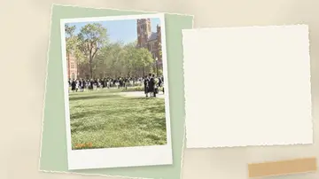</a> <b>毕业照 · 抛帽出框</b> Graduation · The cap flies out of frame by <a href="https://github.com/lemomo-ai">Lemomo</a> · <a href="films/h03-grad/source.jpg">original</a></td></tr>
<tr><td align="center" valign="top" width="33%"> <b>海边婚纱 · 风把它立起来</b> Seaside wedding · The wind stands it up by <a href="https://github.com/lemomo-ai">Lemomo</a> · <a href="films/h04-wedding/source.jpg">original</a></td><td align="center" valign="top" width="33%"> <b>六十年代全家福 · 咔嚓</b> A 1960s family portrait · Click by <a href="https://github.com/lemomo-ai">Lemomo</a> · <a href="films/s12-family/source.jpg">original</a></td><td align="center" valign="top" width="33%"> <b>天台蓝调 · 城市为她亮起</b> Rooftop blue hour · The city lights up for her by <a href="https://github.com/lemomo-ai">Lemomo</a> · <a href="films/s13-rooftop/source.jpg">original</a></td></tr>
</table>

<h2 id="art">Paintings & drawings · 绘画作品 (5)</h2>

<table>
<tr><td align="center" valign="top" width="33%"> <b>月亮不睡觉 · 书里飞出的月亮</b> The moon won't sleep · Out of the book it flies by <a href="https://github.com/lemomo-ai">Lemomo</a> · <a href="films/s05-moon/source.jpg">original</a></td><td align="center" valign="top" width="33%"><a href="films/s09-ink/film.webp">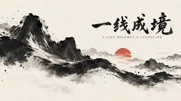</a> <b>一线成境 · 一笔起山</b> One line, one landscape · A brushstroke raises mountains by <a href="https://github.com/lemomo-ai">Lemomo</a> · <a href="films/s09-ink/source.jpg">original</a></td><td align="center" valign="top" width="33%"><a href="films/s10-crayon/film.webp">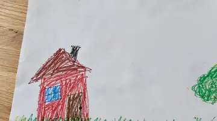</a> <b>小孩蜡笔画 · 彩虹落地</b> A child's crayon drawing · The rainbow lands by <a href="https://github.com/lemomo-ai">Lemomo</a> · <a href="films/s10-crayon/source.jpg">original</a></td></tr>
<tr><td align="center" valign="top" width="33%"> <b>悉尼港 · 钢拱合龙</b> Sydney Harbour · The steel arch closes by <a href="https://github.com/lemomo-ai">Lemomo</a> · <a href="films/sydney/source.jpg">original</a></td><td align="center" valign="top" width="33%"><a href="films/wall/film.webp">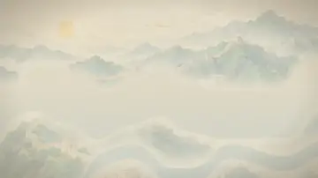</a> <b>长城 · 烽火接力</b> The Great Wall · Beacons pass the fire by <a href="https://github.com/lemomo-ai">Lemomo</a> · <a href="films/wall/source.jpg">original</a></td></tr>
</table>

<h2 id="social">Social posts & chats · 社交分享 (5)</h2>

<table>
<tr><td align="center" valign="top" width="33%"> <b>1000 天纪念日 · 拆红包</b> 1000-day anniversary · Opening the red envelope by <a href="https://github.com/lemomo-ai">Lemomo</a> · <a href="films/m01-anniv/source.jpg">original</a></td><td align="center" valign="top" width="33%"> <b>微信聊天 · 西瓜雨</b> A WeChat chat · Watermelon rain by <a href="https://github.com/lemomo-ai">Lemomo</a> · <a href="films/s14-wechat/source.jpg">original</a></td><td align="center" valign="top" width="33%"> <b>大理 5天4晚 · 刷到就双击</b> Dali, 5 days 4 nights · Scroll, stop, double-tap by <a href="https://github.com/lemomo-ai">Lemomo</a> · <a href="films/x01-dali/source.jpg">original</a></td></tr>
<tr><td align="center" valign="top" width="33%"><a href="films/x02-reading/film.webp">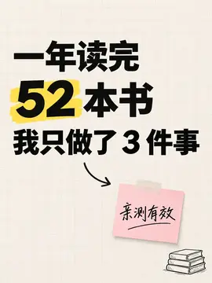</a> <b>一年读完 52 本书 · 52 本书飞进数字</b> 52 books in a year · Books fly into the number by <a href="https://github.com/lemomo-ai">Lemomo</a> · <a href="films/x02-reading/source.jpg">original</a></td><td align="center" valign="top" width="33%"> <b>10分钟番茄鸡蛋面 · 十分钟出锅</b> 10-minute tomato egg noodles · Done in ten by <a href="https://github.com/lemomo-ai">Lemomo</a> · <a href="films/x03-noodles/source.jpg">original</a></td></tr>
</table>

<h2 id="poster">Posters & ads · 海报广告 (8)</h2>

<table>
<tr><td align="center" valign="top" width="33%"><a href="films/b2-rain-a/film.webp">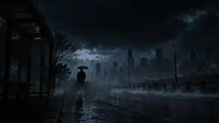</a> <b>雨停之前 · 雷火点灯</b> Before the Rain Stops · Lightning lights the lamps by <a href="https://github.com/lemomo-ai">Lemomo</a> · <a href="films/b2-rain-a/source.jpg">original</a></td><td align="center" valign="top" width="33%"><a href="films/coastal3/film.webp">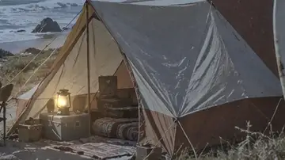</a> <b>去有风的地方 · 灯火揭示</b> Where the Wind Is · Lantern light reveals the coast by <a href="https://github.com/lemomo-ai">Lemomo</a> · <a href="films/coastal3/source.jpg">original</a></td><td align="center" valign="top" width="33%"> <b>夏天有点甜 · 冻出来</b> A little sweet summer · Frozen into shape by <a href="https://github.com/lemomo-ai">Lemomo</a> · <a href="films/fruit-pops-clay/source.jpg">original</a></td></tr>
<tr><td align="center" valign="top" width="33%"><a href="films/paris/film.webp">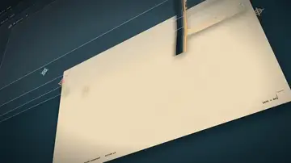</a> <b>巴黎 · 套印合拢</b> Paris · The print plates snap into register by <a href="https://github.com/lemomo-ai">Lemomo</a> · <a href="films/paris/source.jpg">original</a></td><td align="center" valign="top" width="33%"> <b>向未知出发 · 铺路到日出</b> Into the unknown · Paving the way to sunrise by <a href="https://github.com/lemomo-ai">Lemomo</a> · <a href="films/s02-suitcase/source.jpg">original</a></td><td align="center" valign="top" width="33%"><a href="films/s04-forms/film.webp">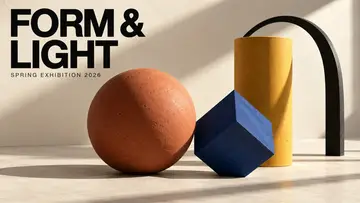</a> <b>FORM &amp; LIGHT · 咔嗒与日光</b> FORM &amp; LIGHT · Click and daylight by <a href="https://github.com/lemomo-ai">Lemomo</a> · <a href="films/s04-forms/source.jpg">original</a></td></tr>
<tr><td align="center" valign="top" width="33%"><a href="films/s06-ocean/film.webp">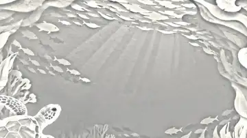</a> <b>给海洋一点蓝 · 一滴蓝</b> A little blue for the ocean · One drop of blue by <a href="https://github.com/lemomo-ai">Lemomo</a> · <a href="films/s06-ocean/source.jpg">original</a></td><td align="center" valign="top" width="33%"> <b>香りの余白 · 香气触发</b> The space of scent · Scent sets it off by <a href="https://github.com/lemomo-ai">Lemomo</a> · <a href="films/scent/source.jpg">original</a></td></tr>
</table>

<h2 id="brand">Logos & brands · 品牌标志 (4)</h2>

<table>
<tr><td align="center" valign="top" width="33%"><a href="films/b01-halora/film.webp">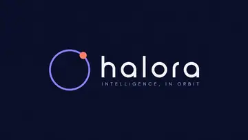</a> <b>halora 标志 · 小球画出自己的轨道</b> halora logo · The ball draws its own orbit by <a href="https://github.com/lemomo-ai">Lemomo</a> · <a href="films/b01-halora/source.jpg">original</a></td><td align="center" valign="top" width="33%"> <b>山隅茶事 · 茶气成山</b> Shanyu Tea House · Steam becomes the mountains by <a href="https://github.com/lemomo-ai">Lemomo</a> · <a href="films/b02-shanyu/source.jpg">original</a></td><td align="center" valign="top" width="33%"><a href="films/b05-solenne/film.webp">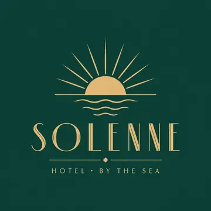</a> <b>SOLENNE 海滨酒店标志 · 日出开扇</b> SOLENNE seaside hotel · Sunrise fans open by <a href="https://github.com/lemomo-ai">Lemomo</a> · <a href="films/b05-solenne/source.jpg">original</a></td></tr>
<tr><td align="center" valign="top" width="33%"><a href="films/b07-moongroove/film.webp">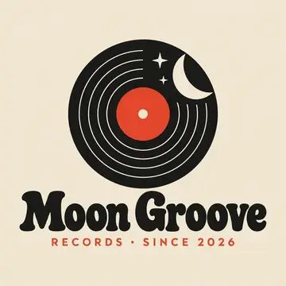</a> <b>Moon Groove Records · 月亮落针</b> Moon Groove Records · The moon drops the needle by <a href="https://github.com/lemomo-ai">Lemomo</a> · <a href="films/b07-moongroove/source.jpg">original</a></td></tr>
</table>

<h2 id="data">Charts & reports · 数据图表 (6)</h2>

<table>
<tr><td align="center" valign="top" width="33%"><a href="films/d01-flow/film.webp">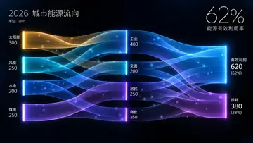</a> <b>城市能源流向 · 能量甩满全图</b> City energy flows · Energy flung across the chart by <a href="https://github.com/lemomo-ai">Lemomo</a> · <a href="films/d01-flow/source.jpg">original</a></td><td align="center" valign="top" width="33%"><a href="films/d02-coffee/film.webp">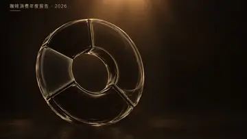</a> <b>咖啡年度报告 · 倒满</b> Annual coffee report · Poured to the brim by <a href="https://github.com/lemomo-ai">Lemomo</a> · <a href="films/d02-coffee/source.jpg">original</a></td><td align="center" valign="top" width="33%"><a href="films/d03-weather/film.webp">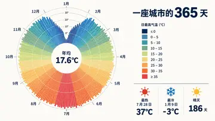</a> <b>一座城市的 365 天 · 一年转一圈</b> 365 days of a city · A year turns full circle by <a href="https://github.com/lemomo-ai">Lemomo</a> · <a href="films/d03-weather/source.jpg">original</a></td></tr>
<tr><td align="center" valign="top" width="33%"><a href="films/d04-energy/film.webp">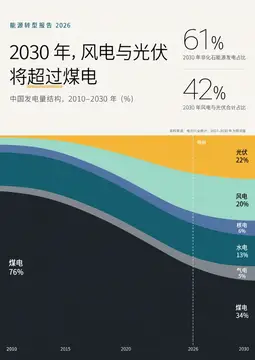</a> <b>风电与光伏将超过煤电 · 时间推杆</b> Wind and solar overtake coal · Pushing time forward by <a href="https://github.com/lemomo-ai">Lemomo</a> · <a href="films/d04-energy/source.jpg">original</a></td><td align="center" valign="top" width="33%"><a href="films/d05-island/film.webp">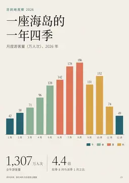</a> <b>一座海岛的一年四季 · 太阳跳过一年</b> An island's four seasons · The sun hops through the year by <a href="https://github.com/lemomo-ai">Lemomo</a> · <a href="films/d05-island/source.jpg">original</a></td><td align="center" valign="top" width="33%"><a href="films/d06-cleanair/film.webp">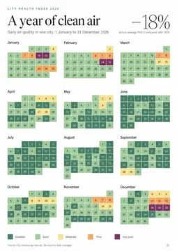</a> <b>A year of clean air · 一阵风吹走一年</b> A year of clean air · A gust blows the year away by <a href="https://github.com/lemomo-ai">Lemomo</a> · <a href="films/d06-cleanair/source.jpg">original</a></td></tr>
</table>

<h2 id="sticker">Stickers & greetings · 表情问候 (4)</h2>

<table>
<tr><td align="center" valign="top" width="33%"> <b>冲鸭！ · 冲出去再冲回来</b> Go, duck! · Dash out and dash back by <a href="https://github.com/lemomo-ai">Lemomo</a> · <a href="films/e03-duck/source.jpg">original</a></td><td align="center" valign="top" width="33%"> <b>线描女孩 · 两支铅笔</b> Line-art girl · Two pencils by <a href="https://github.com/lemomo-ai">Lemomo</a> · <a href="films/e04-lineart/source.jpg">original</a></td><td align="center" valign="top" width="33%"> <b>早上好 · 日出送花</b> Good morning · Flowers at sunrise by <a href="https://github.com/lemomo-ai">Lemomo</a> · <a href="films/e08-zaoshang/source.jpg">original</a></td></tr>
<tr><td align="center" valign="top" width="33%"> <b>平安喜乐 · 仙鹤送福</b> Peace and joy · Cranes bring blessings by <a href="https://github.com/lemomo-ai">Lemomo</a> · <a href="films/e09-pingan/source.jpg">original</a></td></tr>
</table>

<h2 id="life">Everyday photos · 生活随拍 (6)</h2>

<table>
<tr><td align="center" valign="top" width="33%"> <b>炉边三花猫 · 炉火醒来</b> Calico by the fire · The fire wakes up by <a href="https://github.com/lemomo-ai">Lemomo</a> · <a href="films/s01-cat/source.jpg">original</a></td><td align="center" valign="top" width="33%"> <b>窗边早餐 · 早餐蹦蹦</b> Breakfast by the window · Breakfast hops by <a href="https://github.com/lemomo-ai">Lemomo</a> · <a href="films/s03-breakfast/source.jpg">original</a></td><td align="center" valign="top" width="33%"><a href="films/s08-balloons/film.webp">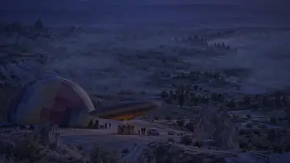</a> <b>日出热气球 · 点火升空</b> Balloons at sunrise · Ignite and lift off by <a href="https://github.com/lemomo-ai">Lemomo</a> · <a href="films/s08-balloons/source.jpg">original</a></td></tr>
<tr><td align="center" valign="top" width="33%"><a href="films/s11-birthday/film.webp">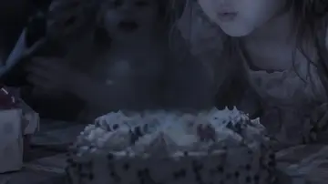</a> <b>吹蜡烛 · 流星许愿</b> Blowing out candles · A wish on a shooting star by <a href="https://github.com/lemomo-ai">Lemomo</a> · <a href="films/s11-birthday/source.jpg">original</a></td><td align="center" valign="top" width="33%"> <b>旅行照片堆 · 咔嚓，一张张拿给你看</b> A pile of travel photos · Click, one by one by <a href="https://github.com/lemomo-ai">Lemomo</a> · <a href="films/t01-flatlay/source.jpg">original</a></td><td align="center" valign="top" width="33%"> <b>夏日旅行日记 · 每张照片都上前来</b> Summer travel diary · Every photo steps forward by <a href="https://github.com/lemomo-ai">Lemomo</a> · <a href="films/t02-collage/source.jpg">original</a></td></tr>
</table>
